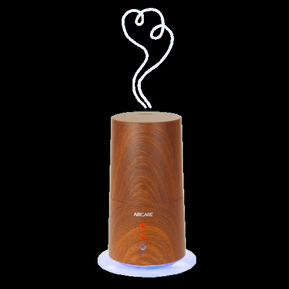
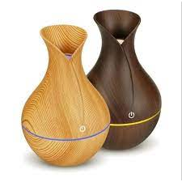
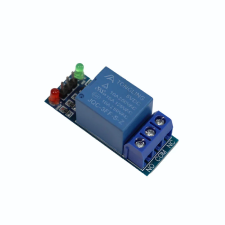
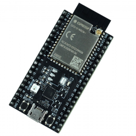
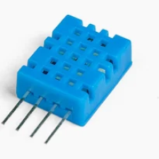
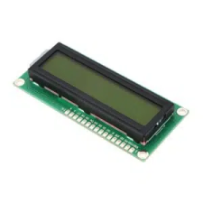

<h1>✨ADV Automação de Umidificadores✨</h1>

O projeto ADV Automação de Umidificadores, foi feito com o objetivo de automatizar o uso de um umidificador. Desenvolvedores: Vitória Castanha, Daniel Santos e Amanda Martarello, acadêmicos do curso de Sistemas de Informação do Centro Universitário Unimater de 🦆Pato Branco🦆 (PR). 

 

<h1>🗒Componentes utilizados🗒</h1>
<ul>
<li a>Primeiramente, foram adquiridos os itens principais:</li>
<h3>Umidificador<h3>

Tem como função manter o nível da umidade de ar do ambiente dentro dos padrões, assim facilitando a respiração. Este aparelho é indicado para lugares secos, abafados e que tenham o uso constante de ar condicionado.

<h3>Relé</h3>

É um interruptor eletromecânico projetado por Michael Faraday na década de 1830, com inúmeras aplicações possíveis em comutação de contatos elétricos, servindo para ligar ou desligar dispositivos.

<h3>Micro controlador esp32 - NodeMCU</h3>

É um pequeno microcontrolador desenvolvido com a capacidade de proporcionar comunicação sem fio através do Wifi e através do próprio sistema Bluetooth. Seu pequeno tamanho e a sua grande eficiência fazem com que este dispositivo destaca-se dentre tantos outros.

<h3>Sensor DHT11<h3>

É um sensor de temperatura e umidade que permite fazer leituras de temperaturas entre 0 a 50 Celsius e umidade entre 20 a 90%

<h3>Display LCD</h3>

É um painel fino usado para exibir as informações de entrada por via eletrônica. Essas informações podem ser texto, vídeos e imagens.

</ul>

<h1>💻Programação💻</h1>

Todos os códigos utilizados neste trabalho foram feitos com o auxílio do docente Rafael Barbosa, e também por parte dos discentes do grupo, com base em seus conhecimentos.

<a href="https://github.com/amandaVolpatto/Projeto_MVP/tree/main/Projects">
👨‍💻Códigos👨‍💻
</a>

<h1>💡Protótipo💡</h1>

<h1>Muito obrigada/o!</h1>
